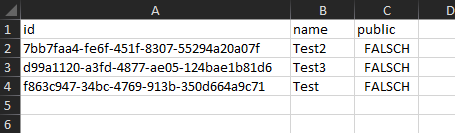

# Aspor Export

Aspor Export extends your OData query capabilities with exporting the results directly into different list based 
file formats. You can use all available OData functionalities such as `$filter`, `$select` and `$expand`. The export
processor will understand your query and write result into the request format. 

Aspor export supports for default the following formats:
 * CSV (.csv)
 * Excel (.xlsx)

<br />

* [Installation](#installation)
* [Configuration](#configuration)
* [OData query usage](#odata-query-usage)
* [Custom format](#custom-format)

## Installation
Aspor Export is available in the `Aspor.Export` NuGet package and can be installed via the command line or
the packet manager in VisualStudio.

```
Install-Package Aspor.Export
```

## Configuration
The export capabilities in your OData api can be unlocked by simply adding `AddAsporExport()`
to your MVC builder.

```csharp
.AddControllers().AddAsporExport()
```

## OData query usage

The usage directly in the OData query is relatively simple, adding `?export=csv` to your
query will return the result in the specified file format.

It is also possible to use `$select` or `$expand` to define the exact result columns.

`http://localhost/v1/projects?$select=id,name,public&export=excel`
This request will return the following result in Excel.



## Custom format

Aspor export allows you to implement every list based file format easily. The export processor will
write in fields and inform as soon a new line should be created.

As example, you can use the `CsvExportFormatWriter` or ExcelExportFormatWriter format writer.

```csharp
public class CustomExportFormatWriter : IExportFormatWriter
{

    public CustomExportFormatWriter()
    {
        //Initzialize the writer
    }

    public string GetDefaultEnding()
    {
        //The ending of your file formatt (e.g. .csv or .xlsx)
    }

    public void WriteField(object? value)
    {
        //Write a new field to your format
    }

    public void NextLine()
    {
        //Move to the next line
    }

    public byte[] ToByteArray()
    {
        //Reutrn the result in a byte array
    }
}
```

To use your custom writer class with `?export=custom`, you have to register it in the static
`ExportFormatRegistry` with a name, and your writer class. 

```csharp
ExportFormatRegistry.RegisterFormat("custom", typeof(CustomExportFormatWriter))
```
